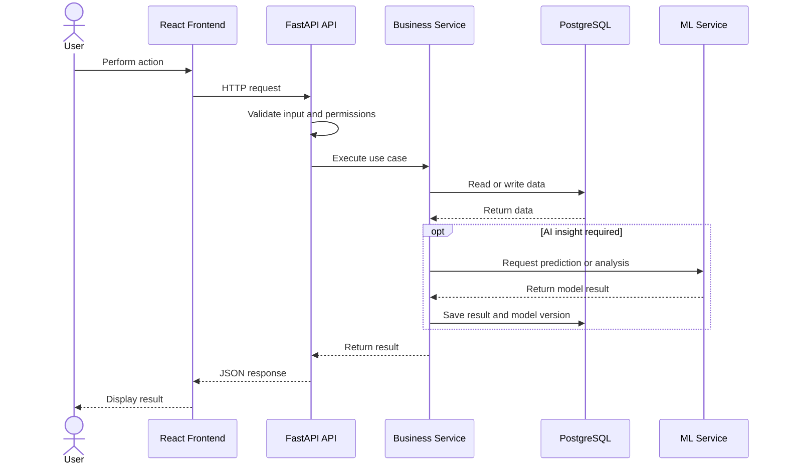
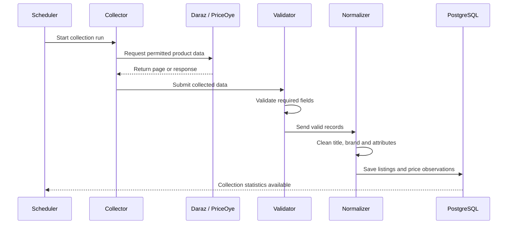
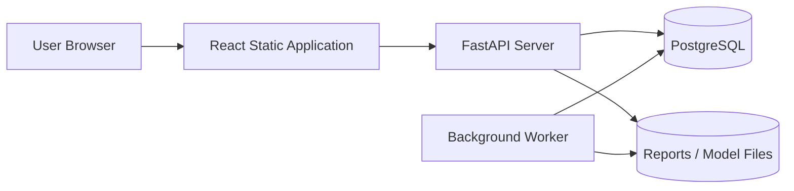

# VEXTRO System Architecture

## Document Information

- **Project:** VEXTRO
- **Version:** 1.0
- **Status:** Initial Architecture Baseline
- **Frontend:** React + Vite
- **Backend:** FastAPI
- **Database:** PostgreSQL
- **ORM:** SQLAlchemy
- **Migrations:** Alembic
- **Machine Learning:** Python-based ML services

---

## High-Level Architecture Diagram

```mermaid
flowchart TB

    subgraph USERS["Users"]
        VISITOR["Visitor"]
        CONSUMER["Consumer"]
        SME["SME User"]
        ADMIN["Administrator"]
    end

    subgraph CLIENT["Presentation Layer"]
        WEB["React Web Application"]
        PUBLIC_UI["Public Pages"]
        CONSUMER_UI["Consumer Dashboard"]
        SME_UI["SME Dashboard"]
        ADMIN_UI["Admin Dashboard"]
    end

    subgraph API["FastAPI Application Layer"]
        ROUTERS["API Routers"]

        AUTH_API["Authentication API"]
        CATALOG_API["Catalog API"]
        SEARCH_API["Search & Comparison API"]
        PRICE_API["Price Intelligence API"]
        REVIEW_API["Review Intelligence API"]
        RECOMMENDATION_API["Recommendation API"]
        SME_API["SME Intelligence API"]
        NOTIFICATION_API["Notification & Reports API"]
        ADMIN_API["Administration API"]
        HEALTH_API["Health API"]
    end

    subgraph SERVICES["Business Service Layer"]
        AUTH_SERVICE["Authentication Service"]
        CATALOG_SERVICE["Catalog Service"]
        MATCHING_SERVICE["Product Matching Service"]
        COMPARISON_SERVICE["Comparison Service"]
        ALERT_SERVICE["Price Alert Service"]
        REVIEW_SERVICE["Review Analysis Service"]
        RECOMMENDATION_SERVICE["Recommendation Service"]
        SME_SERVICE["SME Analytics Service"]
        REPORT_SERVICE["Reporting Service"]
        ADMIN_SERVICE["Administration Service"]
    end

    subgraph BACKGROUND["Background Processing Layer"]
        SCHEDULER["Scheduled Jobs"]
        SCRAPER_WORKER["Data Collection Worker"]
        NORMALIZATION_WORKER["Normalization Worker"]
        ALERT_WORKER["Alert Evaluation Worker"]
        ML_WORKER["ML Inference Worker"]
        REPORT_WORKER["Report Generation Worker"]
    end

    subgraph COLLECTION["Data Acquisition Layer"]
        DARAZ_COLLECTOR["Daraz Collector"]
        PRICEOYE_COLLECTOR["PriceOye Collector"]
        CSV_IMPORTER["CSV / Dataset Importer"]
        VALIDATOR["Data Validator"]
    end

    subgraph ML["Machine Learning Layer"]
        SENTIMENT_MODEL["Sentiment Model"]
        PRICE_MODEL["Price Forecast Model"]
        RECOMMENDATION_MODEL["Recommendation Model"]
        TRUST_MODEL["Trust / Fake Review Model"]
        DEMAND_MODEL["Demand Forecast Model"]
    end

    subgraph DATA["Data Storage Layer"]
        POSTGRES[("PostgreSQL Database")]
        MODEL_STORE[("Model Artifacts")]
        REPORT_STORE[("Generated Reports")]
        RAW_STORE[("Raw Dataset / HTML Storage")]
    end

    subgraph EXTERNAL["External Data Sources"]
        DARAZ["Daraz"]
        PRICEOYE["PriceOye"]
        SME_FILES["SME CSV Files"]
    end

    VISITOR --> WEB
    CONSUMER --> WEB
    SME --> WEB
    ADMIN --> WEB

    WEB --> PUBLIC_UI
    WEB --> CONSUMER_UI
    WEB --> SME_UI
    WEB --> ADMIN_UI

    PUBLIC_UI --> ROUTERS
    CONSUMER_UI --> ROUTERS
    SME_UI --> ROUTERS
    ADMIN_UI --> ROUTERS

    ROUTERS --> AUTH_API
    ROUTERS --> CATALOG_API
    ROUTERS --> SEARCH_API
    ROUTERS --> PRICE_API
    ROUTERS --> REVIEW_API
    ROUTERS --> RECOMMENDATION_API
    ROUTERS --> SME_API
    ROUTERS --> NOTIFICATION_API
    ROUTERS --> ADMIN_API
    ROUTERS --> HEALTH_API

    AUTH_API --> AUTH_SERVICE
    CATALOG_API --> CATALOG_SERVICE
    SEARCH_API --> COMPARISON_SERVICE
    PRICE_API --> ALERT_SERVICE
    REVIEW_API --> REVIEW_SERVICE
    RECOMMENDATION_API --> RECOMMENDATION_SERVICE
    SME_API --> SME_SERVICE
    NOTIFICATION_API --> REPORT_SERVICE
    ADMIN_API --> ADMIN_SERVICE

    CATALOG_SERVICE --> MATCHING_SERVICE

    AUTH_SERVICE --> POSTGRES
    CATALOG_SERVICE --> POSTGRES
    MATCHING_SERVICE --> POSTGRES
    COMPARISON_SERVICE --> POSTGRES
    ALERT_SERVICE --> POSTGRES
    REVIEW_SERVICE --> POSTGRES
    RECOMMENDATION_SERVICE --> POSTGRES
    SME_SERVICE --> POSTGRES
    REPORT_SERVICE --> POSTGRES
    ADMIN_SERVICE --> POSTGRES
    HEALTH_API --> POSTGRES

    SCHEDULER --> SCRAPER_WORKER
    SCHEDULER --> ALERT_WORKER
    SCHEDULER --> ML_WORKER
    SCHEDULER --> REPORT_WORKER

    SCRAPER_WORKER --> DARAZ_COLLECTOR
    SCRAPER_WORKER --> PRICEOYE_COLLECTOR
    SCRAPER_WORKER --> CSV_IMPORTER

    DARAZ --> DARAZ_COLLECTOR
    PRICEOYE --> PRICEOYE_COLLECTOR
    SME_FILES --> CSV_IMPORTER

    DARAZ_COLLECTOR --> VALIDATOR
    PRICEOYE_COLLECTOR --> VALIDATOR
    CSV_IMPORTER --> VALIDATOR

    VALIDATOR --> RAW_STORE
    VALIDATOR --> NORMALIZATION_WORKER
    NORMALIZATION_WORKER --> POSTGRES

    ALERT_WORKER --> POSTGRES
    REPORT_WORKER --> POSTGRES
    REPORT_WORKER --> REPORT_STORE

    ML_WORKER --> SENTIMENT_MODEL
    ML_WORKER --> PRICE_MODEL
    ML_WORKER --> RECOMMENDATION_MODEL
    ML_WORKER --> TRUST_MODEL
    ML_WORKER --> DEMAND_MODEL

    SENTIMENT_MODEL --> MODEL_STORE
    PRICE_MODEL --> MODEL_STORE
    RECOMMENDATION_MODEL --> MODEL_STORE
    TRUST_MODEL --> MODEL_STORE
    DEMAND_MODEL --> MODEL_STORE

    SENTIMENT_MODEL --> POSTGRES
    PRICE_MODEL --> POSTGRES
    RECOMMENDATION_MODEL --> POSTGRES
    TRUST_MODEL --> POSTGRES
    DEMAND_MODEL --> POSTGRES
```

---

## Request Flow

---

## Data Collection Flow

---

## Component Responsibilities

| Component | Responsibility |
|---|---|
| React Web Application | User interface, routing, forms, charts and API communication |
| FastAPI Routers | HTTP endpoints, validation, authentication and response handling |
| Business Services | Application rules and module-specific processing |
| SQLAlchemy | Database access and ORM mapping |
| Alembic | Controlled database schema migrations |
| PostgreSQL | Primary application and analytical data storage |
| Scheduler | Starts recurring data collection, alerts and reports |
| Data Collectors | Acquire supported Daraz and PriceOye data |
| Normalization Worker | Cleans and standardizes marketplace data |
| ML Services | Sentiment, forecasting, recommendations, trust and demand analysis |
| Model Store | Stores trained model artifacts and version information |
| Report Store | Stores generated CSV or report files |
| Admin Dashboard | Monitors users, catalog, data collection, models and system health |

---

## Security Boundaries

1. All protected APIs require a valid access token.
2. Passwords are stored only as secure hashes.
3. Consumer, SME and Admin permissions are role-based.
4. Environment variables and secrets are excluded from Git.
5. Database access is performed through the dedicated `vextro_app` role.
6. Sensitive administrator actions are recorded in audit logs.
7. External data is validated before being stored.
8. Generated AI outputs reference their model version where applicable.

---

## Deployment View

---

## Initial Deployment Strategy

During development, all services may run locally:

- React on port `5173`
- FastAPI on port `8000`
- PostgreSQL on port `5432`
- Background jobs started manually or through a local scheduler

For final deployment, frontend, backend, database and worker processes may be deployed independently.
