# VEXTRO Complete Entity Relationship Diagram

> This single ERD shows the complete planned VEXTRO database structure. Only relationship-critical fields are included so the diagram remains readable.

```mermaid
erDiagram
    USERS {
        bigint id PK
        varchar email UK
        varchar full_name
        varchar password_hash
        boolean is_active
        boolean is_verified
    }

    ROLES {
        bigint id PK
        varchar name UK
    }

    USER_ROLES {
        bigint user_id PK, FK
        bigint role_id PK, FK
    }

    REFRESH_TOKENS {
        bigint id PK
        bigint user_id FK
        varchar token_hash UK
    }

    CATEGORIES {
        bigint id PK
        bigint parent_id FK
        varchar name
        varchar slug UK
    }

    BRANDS {
        bigint id PK
        varchar name UK
        varchar slug UK
    }

    PLATFORMS {
        bigint id PK
        varchar name UK
        varchar code UK
    }

    CANONICAL_PRODUCTS {
        bigint id PK
        bigint category_id FK
        bigint brand_id FK
        varchar name
        varchar model
    }

    PRODUCT_VARIANTS {
        bigint id PK
        bigint canonical_product_id FK
        varchar sku
        jsonb variant_attributes
    }

    SELLERS {
        bigint id PK
        bigint platform_id FK
        varchar external_seller_id
        varchar name
    }

    PRODUCT_LISTINGS {
        bigint id PK
        bigint platform_id FK
        bigint product_variant_id FK
        bigint seller_id FK
        varchar external_id
        numeric current_price
    }

    PRODUCT_IMAGES {
        bigint id PK
        bigint canonical_product_id FK
        bigint listing_id FK
        text image_url
    }

    SCRAPE_RUNS {
        bigint id PK
        bigint platform_id FK
        varchar status
    }

    SCRAPE_ERRORS {
        bigint id PK
        bigint scrape_run_id FK
        varchar error_type
    }

    PRICE_OBSERVATIONS {
        bigint id PK
        bigint listing_id FK
        numeric price
        timestamptz observed_at
    }

    PRICE_ALERTS {
        bigint id PK
        bigint user_id FK
        bigint product_variant_id FK
        numeric target_price
    }

    MODEL_VERSIONS {
        bigint id PK
        varchar model_name
        varchar version
        boolean is_active
    }

    PRICE_FORECASTS {
        bigint id PK
        bigint product_variant_id FK
        bigint model_version_id FK
        date forecast_date
        numeric predicted_price
    }

    MARKET_ANOMALIES {
        bigint id PK
        bigint listing_id FK
        varchar anomaly_type
    }

    RAW_REVIEWS {
        bigint id PK
        bigint listing_id FK
        bigint seller_id FK
        integer rating
        text review_text
    }

    SENTIMENT_RESULTS {
        bigint id PK
        bigint review_id FK
        bigint model_version_id FK
        varchar sentiment_label
    }

    ASPECT_SENTIMENTS {
        bigint id PK
        bigint review_id FK
        bigint model_version_id FK
        varchar aspect
        varchar sentiment_label
    }

    REVIEW_SUMMARIES {
        bigint id PK
        bigint product_variant_id FK
        bigint model_version_id FK
    }

    FAKE_REVIEW_RESULTS {
        bigint id PK
        bigint review_id FK
        bigint model_version_id FK
        numeric suspicious_score
    }

    SELLER_TRUST_SCORES {
        bigint id PK
        bigint seller_id FK
        bigint model_version_id FK
        numeric trust_score
    }

    USER_EVENTS {
        bigint id PK
        bigint user_id FK
        bigint product_variant_id FK
        varchar event_type
    }

    USER_PREFERENCES {
        bigint id PK
        bigint user_id FK
    }

    WATCHLISTS {
        bigint id PK
        bigint user_id FK
        bigint product_variant_id FK
    }

    SAVED_COMPARISONS {
        bigint id PK
        bigint user_id FK
        varchar title
    }

    SAVED_COMPARISON_ITEMS {
        bigint comparison_id PK, FK
        bigint listing_id PK, FK
    }

    RECOMMENDATION_RESULTS {
        bigint id PK
        bigint user_id FK
        bigint product_variant_id FK
        bigint model_version_id FK
    }

    ORGANIZATIONS {
        bigint id PK
        varchar name
        varchar industry
    }

    ORGANIZATION_USERS {
        bigint organization_id PK, FK
        bigint user_id PK, FK
        varchar organization_role
    }

    BUSINESS_PRODUCTS {
        bigint id PK
        bigint organization_id FK
        bigint product_variant_id FK
        varchar internal_sku
    }

    COMPETITOR_WATCHLISTS {
        bigint id PK
        bigint business_product_id FK
        bigint listing_id FK
    }

    SALES_IMPORTS {
        bigint id PK
        bigint organization_id FK
        bigint uploaded_by_user_id FK
    }

    SALES_RECORDS {
        bigint id PK
        bigint sales_import_id FK
        bigint business_product_id FK
        date sale_date
    }

    INVENTORY_SNAPSHOTS {
        bigint id PK
        bigint business_product_id FK
        integer stock_quantity
    }

    DEMAND_FORECASTS {
        bigint id PK
        bigint business_product_id FK
        bigint model_version_id FK
        numeric predicted_demand
    }

    PRICING_SCENARIOS {
        bigint id PK
        bigint business_product_id FK
        bigint created_by_user_id FK
        numeric proposed_price
    }

    NOTIFICATIONS {
        bigint id PK
        bigint user_id FK
        varchar notification_type
        boolean is_read
    }

    REPORTS {
        bigint id PK
        bigint requested_by_user_id FK
        bigint organization_id FK
        varchar report_type
    }

    AUDIT_LOGS {
        bigint id PK
        bigint user_id FK
        varchar action
        varchar resource_type
    }

    USERS ||--o{ USER_ROLES : has
    ROLES ||--o{ USER_ROLES : grants
    USERS ||--o{ REFRESH_TOKENS : owns

    CATEGORIES o|--o{ CATEGORIES : parent_of
    CATEGORIES ||--o{ CANONICAL_PRODUCTS : classifies
    BRANDS ||--o{ CANONICAL_PRODUCTS : identifies
    CANONICAL_PRODUCTS ||--o{ PRODUCT_VARIANTS : contains

    PLATFORMS ||--o{ SELLERS : hosts
    PLATFORMS ||--o{ PRODUCT_LISTINGS : publishes
    SELLERS o|--o{ PRODUCT_LISTINGS : offers
    PRODUCT_VARIANTS ||--o{ PRODUCT_LISTINGS : listed_as
    CANONICAL_PRODUCTS o|--o{ PRODUCT_IMAGES : has
    PRODUCT_LISTINGS o|--o{ PRODUCT_IMAGES : supplies

    PLATFORMS ||--o{ SCRAPE_RUNS : collected_from
    SCRAPE_RUNS ||--o{ SCRAPE_ERRORS : produces

    PRODUCT_LISTINGS ||--o{ PRICE_OBSERVATIONS : records
    USERS ||--o{ PRICE_ALERTS : creates
    PRODUCT_VARIANTS ||--o{ PRICE_ALERTS : monitors
    PRODUCT_VARIANTS ||--o{ PRICE_FORECASTS : receives
    MODEL_VERSIONS ||--o{ PRICE_FORECASTS : powers
    PRODUCT_LISTINGS ||--o{ MARKET_ANOMALIES : may_have

    PRODUCT_LISTINGS ||--o{ RAW_REVIEWS : receives
    SELLERS o|--o{ RAW_REVIEWS : associated_with
    RAW_REVIEWS ||--o| SENTIMENT_RESULTS : analyzed_as
    RAW_REVIEWS ||--o{ ASPECT_SENTIMENTS : analyzed_for
    RAW_REVIEWS ||--o| FAKE_REVIEW_RESULTS : inspected_by
    PRODUCT_VARIANTS ||--o{ REVIEW_SUMMARIES : summarized_as
    SELLERS ||--o{ SELLER_TRUST_SCORES : evaluated_by
    MODEL_VERSIONS ||--o{ SENTIMENT_RESULTS : powers
    MODEL_VERSIONS ||--o{ ASPECT_SENTIMENTS : powers
    MODEL_VERSIONS ||--o{ REVIEW_SUMMARIES : powers
    MODEL_VERSIONS ||--o{ FAKE_REVIEW_RESULTS : powers
    MODEL_VERSIONS ||--o{ SELLER_TRUST_SCORES : powers

    USERS ||--o{ USER_EVENTS : generates
    PRODUCT_VARIANTS ||--o{ USER_EVENTS : receives
    USERS ||--o| USER_PREFERENCES : has
    USERS ||--o{ WATCHLISTS : owns
    PRODUCT_VARIANTS ||--o{ WATCHLISTS : saved_in
    USERS ||--o{ SAVED_COMPARISONS : creates
    SAVED_COMPARISONS ||--o{ SAVED_COMPARISON_ITEMS : contains
    PRODUCT_LISTINGS ||--o{ SAVED_COMPARISON_ITEMS : selected_in
    USERS ||--o{ RECOMMENDATION_RESULTS : receives
    PRODUCT_VARIANTS ||--o{ RECOMMENDATION_RESULTS : recommended_as
    MODEL_VERSIONS ||--o{ RECOMMENDATION_RESULTS : powers

    ORGANIZATIONS ||--o{ ORGANIZATION_USERS : includes
    USERS ||--o{ ORGANIZATION_USERS : joins
    ORGANIZATIONS ||--o{ BUSINESS_PRODUCTS : owns
    PRODUCT_VARIANTS ||--o{ BUSINESS_PRODUCTS : maps_to
    BUSINESS_PRODUCTS ||--o{ COMPETITOR_WATCHLISTS : monitors
    PRODUCT_LISTINGS ||--o{ COMPETITOR_WATCHLISTS : selected_as
    ORGANIZATIONS ||--o{ SALES_IMPORTS : owns
    USERS ||--o{ SALES_IMPORTS : uploads
    SALES_IMPORTS ||--o{ SALES_RECORDS : contains
    BUSINESS_PRODUCTS ||--o{ SALES_RECORDS : records
    BUSINESS_PRODUCTS ||--o{ INVENTORY_SNAPSHOTS : tracks
    BUSINESS_PRODUCTS ||--o{ DEMAND_FORECASTS : receives
    MODEL_VERSIONS ||--o{ DEMAND_FORECASTS : powers
    BUSINESS_PRODUCTS ||--o{ PRICING_SCENARIOS : evaluates
    USERS ||--o{ PRICING_SCENARIOS : creates

    USERS ||--o{ NOTIFICATIONS : receives
    USERS ||--o{ REPORTS : requests
    ORGANIZATIONS o|--o{ REPORTS : relates_to
    USERS ||--o{ AUDIT_LOGS : performs
```

