# VEXTRO Visual Use-Case Diagram

## Complete System Use Cases

```mermaid
flowchart LR

    Visitor([Visitor])
    Consumer([Consumer])
    SME([SME User])
    Admin([Administrator])
    Scheduler([Data Collection Scheduler])
    MLService([Machine Learning Service])

    subgraph VEXTRO["VEXTRO System"]

        subgraph Public["Public and Authentication"]
            Landing([View Landing Page])
            Register([Register Account])
            Login([Login])
            RefreshToken([Refresh Session])
            Logout([Logout])
        end

        subgraph ConsumerModule["Consumer Module"]
            Search([Search Products])
            Filter([Filter and Sort Products])
            ProductDetails([View Product Details])
            Compare([Compare Daraz and PriceOye Listings])
            PriceHistory([View Price History])
            PriceAlert([Create and Manage Price Alerts])
            Watchlist([Manage Watchlist])
            ReviewInsights([View Review Sentiment])
            BuyingGuidance([View Buying Guidance])
            Recommendations([View Recommendations])
            SavedComparisons([Save Product Comparisons])
            ConsumerDashboard([View Consumer Dashboard])
            Notifications([View Notifications])
        end

        subgraph SMEIntelligence["SME Business Intelligence"]
            BusinessProfile([Manage Business Profile])
            BusinessProducts([Manage Business Products])
            CompetitorMonitor([Monitor Competitors])
            CompetitorAnalysis([View Competitor Analysis])
            SalesImport([Import Sales CSV])
            DemandForecast([View Demand Forecast])
            InventoryAdvice([View Inventory Recommendation])
            PricingAdvisor([Use Pricing Advisor])
            SMEReports([Generate SME Reports])
            SMEDashboard([View SME Dashboard])
        end

        subgraph AdminModule["Administration"]
            ManageUsers([Manage Users])
            ManageCatalog([Manage Products and Listings])
            ProductMatches([Resolve Product Matches])
            MonitorScraping([Monitor Data Collection])
            ManualScrape([Start Manual Collection Run])
            MonitorModels([Monitor ML Models])
            SystemHealth([View System Health])
            AuditLogs([View Audit Logs])
            AdminDashboard([View Admin Dashboard])
        end

        subgraph AutomatedProcesses["Automated Processes"]
            ScheduledCollection([Collect Marketplace Data])
            ValidateData([Validate Collected Data])
            NormalizeData([Normalize and Match Products])
            StorePrice([Store Price Observations])
            EvaluateAlerts([Evaluate Price Alerts])
            GenerateNotification([Generate Notifications])
            SentimentAnalysis([Analyze Review Sentiment])
            PriceForecasting([Generate Price Forecast])
            RecommendationEngine([Generate Recommendations])
            DemandPrediction([Generate Demand Forecast])
            TrustAnalysis([Calculate Trust and Review Risk])
            ReportGeneration([Generate Requested Reports])
        end
    end

    Visitor --> Landing
    Visitor --> Register
    Visitor --> Login

    Consumer --> Login
    Consumer --> RefreshToken
    Consumer --> Logout
    Consumer --> Search
    Consumer --> Filter
    Consumer --> ProductDetails
    Consumer --> Compare
    Consumer --> PriceHistory
    Consumer --> PriceAlert
    Consumer --> Watchlist
    Consumer --> ReviewInsights
    Consumer --> BuyingGuidance
    Consumer --> Recommendations
    Consumer --> SavedComparisons
    Consumer --> ConsumerDashboard
    Consumer --> Notifications

    SME --> Login
    SME --> RefreshToken
    SME --> Logout
    SME --> Search
    SME --> Compare
    SME --> BusinessProfile
    SME --> BusinessProducts
    SME --> CompetitorMonitor
    SME --> CompetitorAnalysis
    SME --> SalesImport
    SME --> DemandForecast
    SME --> InventoryAdvice
    SME --> PricingAdvisor
    SME --> SMEReports
    SME --> SMEDashboard
    SME --> Notifications

    Admin --> Login
    Admin --> ManageUsers
    Admin --> ManageCatalog
    Admin --> ProductMatches
    Admin --> MonitorScraping
    Admin --> ManualScrape
    Admin --> MonitorModels
    Admin --> SystemHealth
    Admin --> AuditLogs
    Admin --> AdminDashboard

    Scheduler --> ScheduledCollection
    Scheduler --> EvaluateAlerts
    Scheduler --> ReportGeneration

    MLService --> SentimentAnalysis
    MLService --> PriceForecasting
    MLService --> RecommendationEngine
    MLService --> DemandPrediction
    MLService --> TrustAnalysis

    Search -. includes .-> Filter
    ProductDetails -. includes .-> Compare
    ProductDetails -. includes .-> PriceHistory
    ProductDetails -. includes .-> ReviewInsights
    ConsumerDashboard -. includes .-> Watchlist
    ConsumerDashboard -. includes .-> PriceAlert
    ConsumerDashboard -. includes .-> Recommendations

    BusinessProducts -. includes .-> CompetitorMonitor
    SMEDashboard -. includes .-> CompetitorAnalysis
    SMEDashboard -. includes .-> DemandForecast
    SMEDashboard -. includes .-> InventoryAdvice
    SMEDashboard -. includes .-> PricingAdvisor

    ScheduledCollection --> ValidateData
    ValidateData --> NormalizeData
    NormalizeData --> StorePrice
    StorePrice --> EvaluateAlerts
    EvaluateAlerts --> GenerateNotification

    SentimentAnalysis --> ReviewInsights
    PriceForecasting --> BuyingGuidance
    RecommendationEngine --> Recommendations
    DemandPrediction --> DemandForecast
    TrustAnalysis --> ReviewInsights
    ReportGeneration --> SMEReports
```

---

## Actor Summary

| Actor | Primary Purpose |
|---|---|
| Visitor | Understand VEXTRO, register and log in |
| Consumer | Search, compare, track and analyze products |
| SME User | Monitor competitors, pricing, demand and inventory |
| Administrator | Manage users, data, models and system operations |
| Data Collection Scheduler | Run recurring collection and alert processes |
| Machine Learning Service | Generate AI predictions and analytical results |

---

## Access Principle

- Visitors can access public pages and authentication.
- Consumers access shopping intelligence features.
- SME users access business intelligence features.
- Administrators access management and monitoring functions.
- Automated actors run scheduled collection and AI processing.
